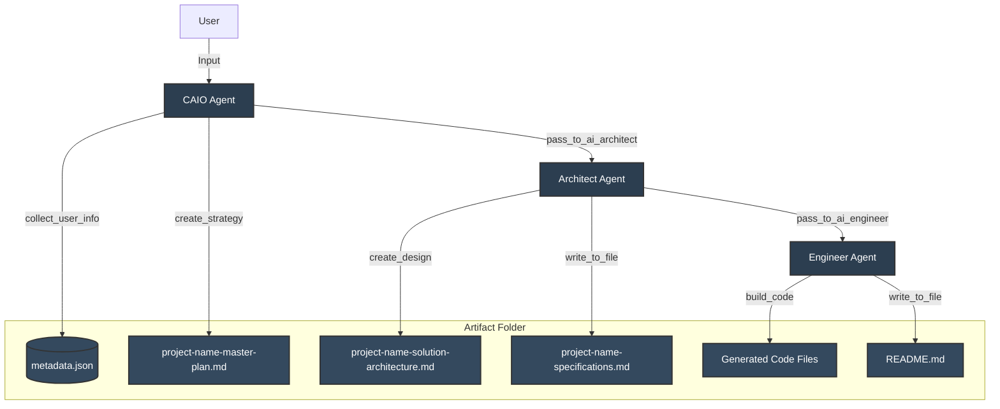

# WhitegloveAI Consulting Agent
***This is an experimental project to explore the use of Swarm for AI consulting. Not for production use. We strongly recommend a human in the loop and proper training and knowledge transfer of AI solutions. Contact us for more @ https://www.whitegloveai.com***

AI consulting agent that uses the Swarm framework to analyze project specifications and build the neccesary artifacts repository for strategy and implementations.


## Installation

```bash
# Create and activate virtual environment
python3 -m venv ./venv
source ./venv/bin/activate

# Install Swarm and dependencies
pip install git+https://github.com/openai/swarm.git
pip install -r requirements.txt
```

## Setup

Copy the .env.example file to .env and supply your OpenAI API key. 

## Usage

```bash
python index.py
```
